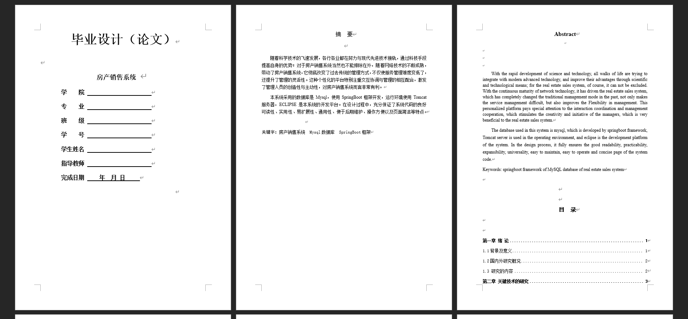
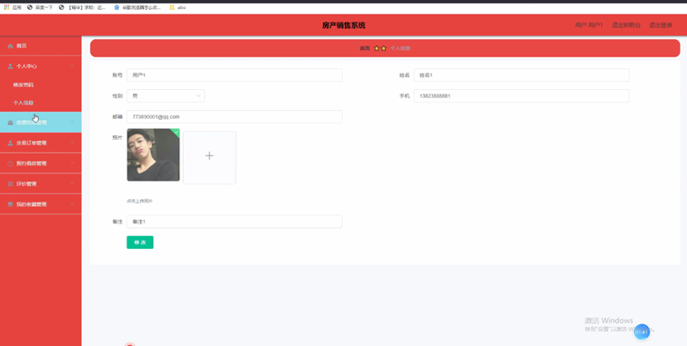
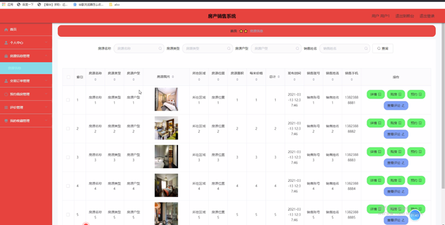
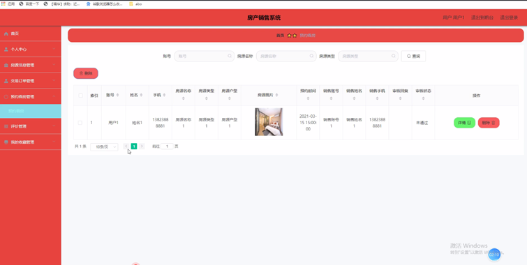
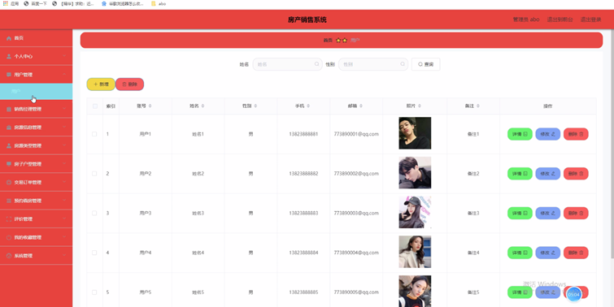
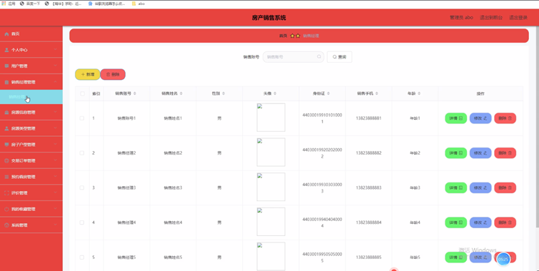
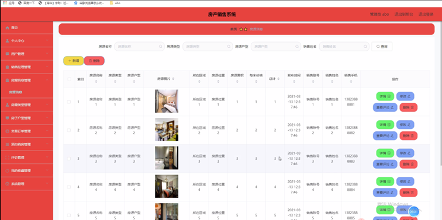
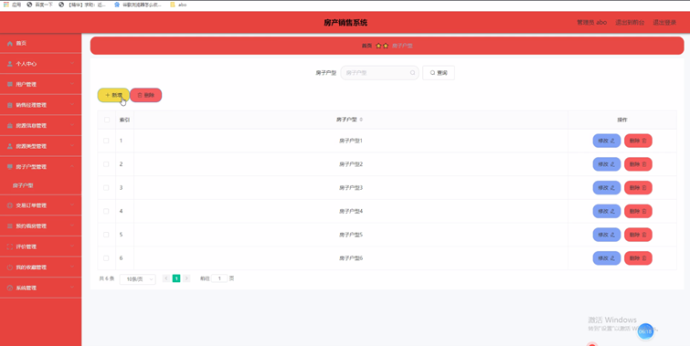
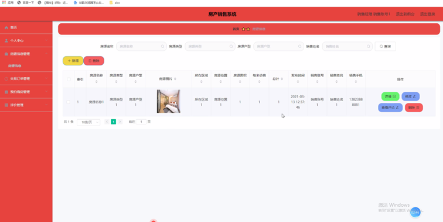
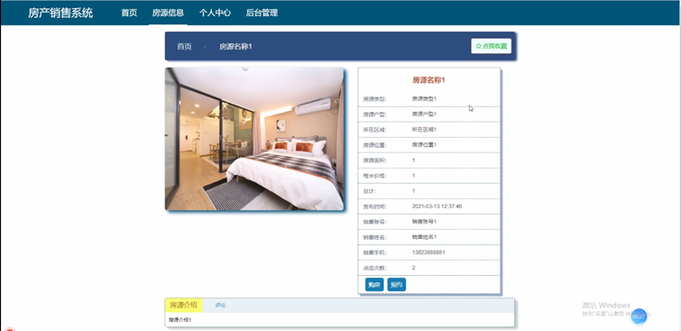

基于SpringBoot的房产销售系统（程序+论文）
=
- 完整代码获取地址：从戎源码网 ([https://armycodes.com/](https://armycodes.com/))
- 作者微信：19941326836  QQ：952045282 
- 承接计算机毕业设计、Java毕业设计、Python毕业设计、深度学习、机器学习
- 选题+开题报告+任务书+程序定制+安装调试+论文+答辩ppt 一条龙服务
- 所有选题地址https://github.com/nature924/allProject

一、项目介绍
---
系统包含两种角色：用户、管理员，系统分为前台和后台两大模块，主要功能如下：

### 1 用户功能模块

用户登录后可以访问以下功能模块：
- 个人信息：用户可以查看和修改账号、姓名、性别、手机、邮箱、照片、备注等信息。
- 房源信息管理：用户可以查看房源的名称、类型、户型、图片、区域、位置、面积、价格、发布时间、销售账号、姓名和手机等信息，并进行详情查看、购房、预约和评论操作。
- 交易订单管理：用户可以查看订单的编号、房源信息、总计、销售账号、姓名、交易时间、备注和支付状态等信息，并进行详情查看、评价和删除操作。
- 预约看房管理：用户可以查看预约的房源信息、预约时间、销售账号、姓名、手机、审核回复和状态等信息，并进行详情和删除操作。
- 我的收藏管理：用户可以查看收藏的房源名称和图片，并进行详情、修改和删除操作。

### 2 管理员功能模块

管理员登录后可以访问以下功能模块：
- 用户管理：管理员可以查看和管理用户的账号、姓名、性别、手机、邮箱、照片和备注等信息，进行详情查看、修改和删除操作。
- 销售经理管理：管理员可以查看销售经理的账号、姓名、性别、头像、身份证、手机、年龄等信息，并进行详情查看、删除和修改操作。
- 房源信息管理：管理员可以管理房源的信息，包括名称、类型、户型、图片、区域、位置、面积、价格、发布时间、销售账号、姓名和手机等，进行详情查看、修改、评论查看和删除操作。
- 房源类型管理：管理员可以管理房源的类型信息，并进行修改或删除操作。
- 房子户型管理：管理员可以管理房子的户型信息，并进行修改或删除操作。
- 交易订单管理：管理员可以管理订单的信息，包括编号、房源信息、总计、销售账号、姓名、交易时间、备注和支付状态等，进行详情查看、修改和删除操作。

### 3 销售经理功能模块

销售经理登录后可以访问以下功能模块：
- 房源信息管理：销售经理可以查看和管理房源的相关信息，包括名称、类型、户型、图片、区域、位置、面积、价格、发布时间、销售账号、姓名和手机等，并进行详情查看、修改、评论查看和删除操作。
- 预约看房管理：销售经理可以查看预约信息，包括账号、姓名、手机、房源信息、预约时间、销售账号、姓名、手机、审核回复和状态等，并进行详情查看、修改和删除操作。

### 4 前台首页功能模块

在前台首页，用户可以访问以下内容：
- 首页：浏览系统的主要内容。
- 房源信息：用户可以查看房源的详细信息，包括名称、类型、户型、图片、区域、位置、面积、价格、发布时间、销售账号、姓名和手机等，并进行购房、预约和收藏操作。
- 个人中心：用户可以查看和更新个人信息，包括账号、密码、姓名、性别、手机、邮箱、照片和备注等。

二、项目技术
---
- 编程语言：Java
- 数据库：MySQL
- 项目管理工具：Maven
- 前端技术：VUE、HTML、Jquery、Bootstrap
- 后端技术：Spring、SpringMVC、MyBatis

三、运行环境
---
- 操作系统：Windows、macOS都可以
- JDK版本：JDK1.8以上都可以
- 开发工具：IDEA、Ecplise、Myecplise都可以
- 数据库: MySQL5.7以上都可以
- Tomcat：任意版本都可以
- Maven：任意版本都可以

四、运行截图
---
### 论文截图：

### 程序截图：

